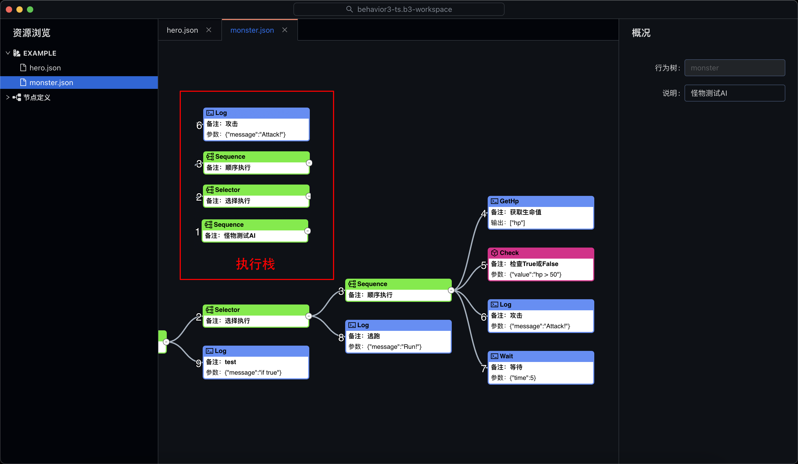
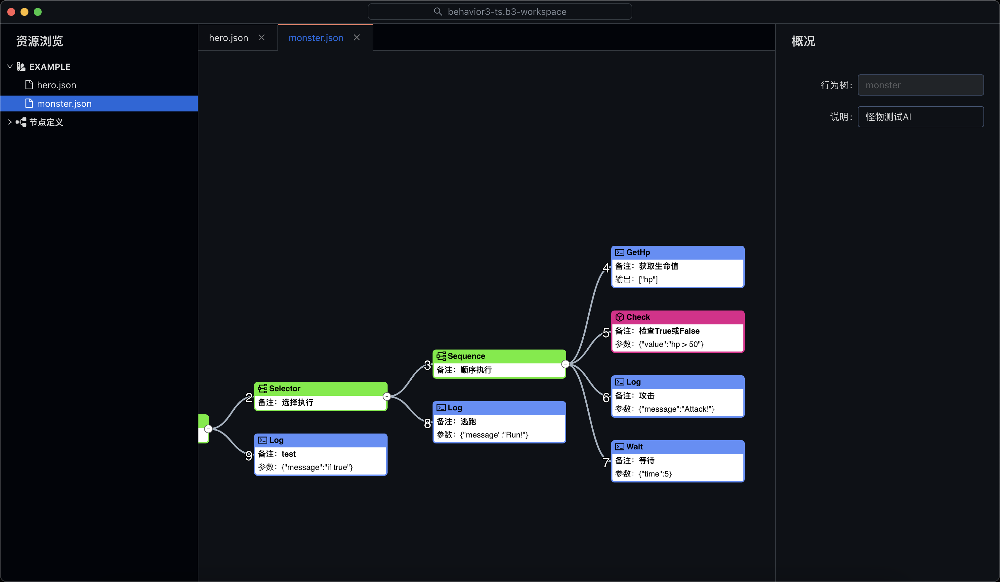

# 行为树框架 for typescript/javascript

## 用途

在游戏中使用行为树，可以大大的降低 AI、技能、BUFF 实现的复杂度，同时提高配置的灵活度，而且更加容易找到游戏行为中的问题。

以下是最主要的使用用途：

-   游戏中的人物的 AI
-   游戏中的技能和 BUFF
-   游戏中 NPC 的工作流程
-   游戏中的新手引导
-   游戏中的业务工作流或决策行为

## 节点定义

```javascript
export interface NodeDef {
    name: string;
    /**
     * Recommended type used for the node definition:
     * + `Action`: No children allowed, returns `success`, `failure` or `running`.
     * + `Decorator`: Only one child allowed, returns `success`, `failure` or `running`.
     * + `Composite`: Contains more than one child, returns `success`, `failure` or `running`.
     * + `Condition`: No children allowed, no output, returns `success` or `failure`.
     */
    type: "Action" | "Decorator" | "Condition" | "Composite";
    desc: string;
    input?: string[]; // ["input1?", "input2..."]
    output?: string[]; // ["output1", "output2..."]
    args?: {
        name: string,
        type:
            | "bool"
            | "bool?"
            | "bool[]"
            | "bool[]?"
            | "int"
            | "int?"
            | "int[]"
            | "int[]?"
            | "float"
            | "float?"
            | "float[]"
            | "float[]?"
            | "string"
            | "string?"
            | "string[]"
            | "string[]?"
            | "json"
            | "json?"
            | "json[]"
            | "json[]?"
            | "enum"
            | "enum?"
            | "enum[]"
            | "enum[]?"
            | "expr"
            | "expr?"
            | "expr[]"
            | "expr[]?",
        desc: string,
        oneof?: string, // Input `value`, only one is allowed between `value` and this arg.
        default?: unknown,
        options?: { name: string, value: unknown, desc?: string }[],
    }[];
    doc?: string; // markdown
}
```

#### 常量

通常是固定值，比如范围，类型之类的，常量支持可选和必填。

#### 输入/输出变量

通常情况，一个节点并不能完成自己的工作，需要依赖于上一个节点的输出，或者依赖于外部的输入，所以大多数行为树设计都会提供一个数据结构来记录节点的运行状态，称之为“黑板”，节点可以从黑板中读取变量，也可以写入变量。

让我们来看一个简单的例子，在特定的范围（`w`, `h`）内寻找大于指定数量（`count`）的敌人，并把找到的敌人放在变量 `target` 中，这个节点的大致实现如下：

```typescript
type NodeArgs = {
    readonly w: number;
    readonly h: number;
};

type NodeInput = [number];

export class FindEnemy extends Process {
    override get descriptor(): NodeDef {
        return {
            name: "FindEnemy",
            type: "Action",
            desc: "寻找敌人",
            args: [
                { name: "w", type: "int", desc: "宽度" },
                { name: "h", type: "int", desc: "高度" },
            ],
            input: ["count"],
            output: ["target"],
        };
    }

    override run(node: Node, env: RoleTreeEnv) {
        const [count] = node.input as NodeInput;
        const { x, y } = env.owner;
        const { w, h } = node.args as NodeArgs;
        const list = env.context.find((role: Role) => {
            if (role === env.owner) {
                return false;
            }
            const tx = role.x;
            const ty = role.y;
            return Math.abs(x - tx) <= w && Math.abs(y - ty) <= h;
        });
        if (list.length >= count) {
            env.output.push(...list);
            return "success";
        } else {
            return "failure";
        }
    }
}
```

上述节点执行成功后，黑板上的 `target` 变量就会被赋值成查找到的敌人列表，这样后面的节点就可以使用 `target` 这个变量作为输入了。

#### 状态返回

我们使用栈来实现行为树的调度，当行为树节点运行的时候，把会节点压入栈，只有当节点返回 `success` 或 `failure` 时，才会出栈，继续执行下一个节点，否则会一直执行栈顶的节点，直到返回 `success` 或 `failure` 为止。

-   success 节点执行成功
-   failure 节点执行失败
-   running 节点运行中



## 内置节点

### 行为节点

-   Calculate 简单的数值公式计算
-   Concate 拼接两个数组
-   GetField 获取对象的字段值
-   Index 获取数组的元素
-   Let 定义变量
-   Log 打印日志
-   Push 向数组中添加元素
-   RandomIndex 随机返回数组中一个
-   Random 返回一个随机数值
-   SetField 设置对象的字段值
-   Wait 等待一段时间

### 复合节点

-   Race 竞争执行，并行执行所有子节点，优先返回第一个成功的子节点
-   Parallel 并行执行, 执行所有子节点
-   Sequence 顺序执行，执行所有子节点直到返回 false
-   Selector 选择执行，执行所有子节点直到返回 true
-   IfElse 条件执行，根据条件执行不同的子节点，并返回子节点扫执行状态
-   Switch 分支执行，根据 `case` 条件执行不同的分支子节点，并返回分支子节点扫执行状态

### 条件节点

-   Check 检查表达式
-   IsNull 检查值是否为空
-   NotNull 检查值是否不为空
-   Includes 判断元素是否在数组中

### 装饰节点

-   AlwaysSuccess 永远返回成功
-   AlwaysFailure 永远返回失败
-   Assert 断言，如果断言失败，抛出异常，一般用于调试测试
-   Delay 延时执行子节点
-   Filter 返回满足条件的元素
-   Foreach 遍历数组
-   Invert 反转子节点执行状态
-   Listen 监听事件并执行子节点
-   Once 只执行一次
-   Repeat 重复执行子节点
-   RepeatUntilFailure 重复执行子节点直到返回失败
-   RepeatUntilSuccess 重复执行子节点直到返回成功
-   Timeout 限定时间内执行子节点

## 编辑器

基于 antv G6 图形库开发了一个通用的行为树编辑器，感兴趣的同学可以关注一下 [behavior3editor](https://github.com/zhandouxiaojiji/behavior3editor)


## 运行测试用例

-   导出节点定义

```
// fs.writeFileSync("example/node-config.b3-setting", context.exportNodeDefs());
tsx test/main.ts
```

-   运行测试

```
npx tsx test/main.ts
```
